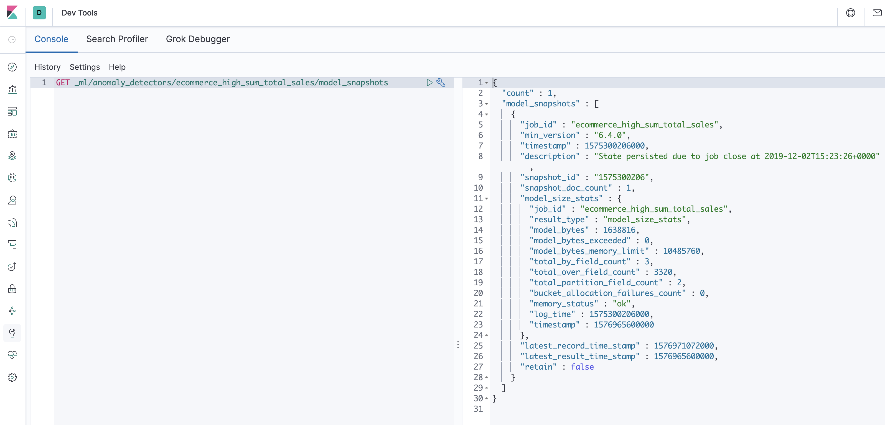
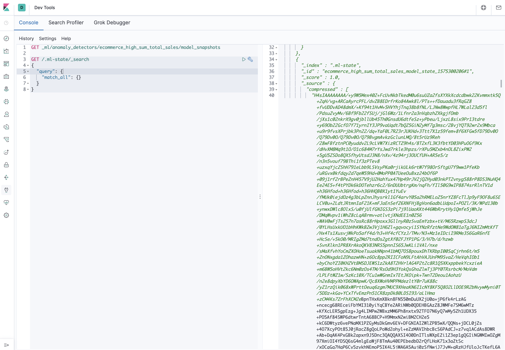
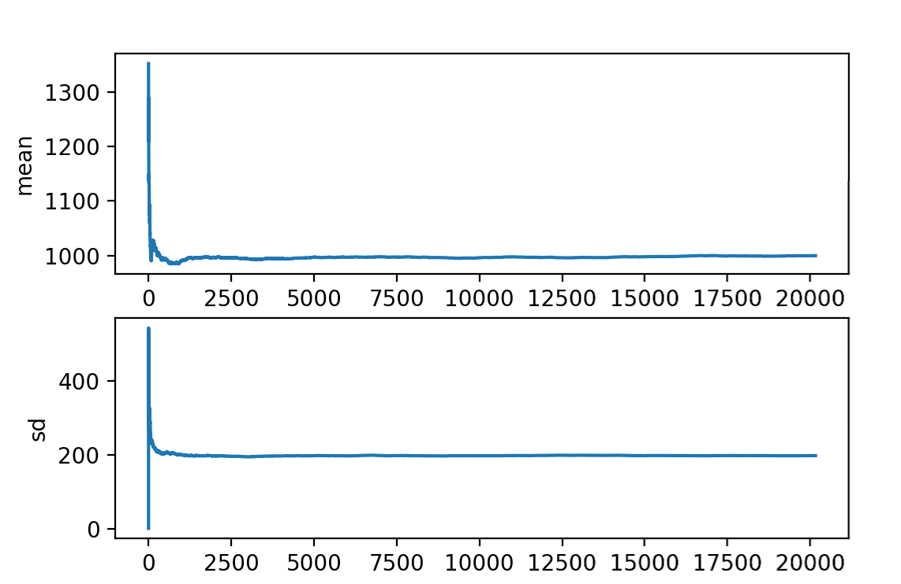

Ever wondered what's _really_ going on behind the scenes with Elastic's
unsupervised machine learning anomaly detection modelling? (and if not
why not?!) Sure you may think you know what's going on, you've read our
extensive and beautifully written
[documentation](https://www.elastic.co/guide/en/elastic-stack-overview/current/xpack-ml.html),
maybe you've even enabled
model plot
in the job configuration and [viewed the results in the single metric
viewer](https://www.elastic.co/guide/en/kibana/current/xpack-ml-anomalies.html)
(but would you like to know more?). Maybe you've downloaded the backend
[source code](https://github.com/elastic/ml-cpp),
[compiled it](https://github.com/elastic/ml-cpp/blob/master/CONTRIBUTING.md),
and ran the extensive tests. If you have, kudos to you! But do you
want to understand what those tests are about? Read on!

For many reasons, the anomaly detector model state is snapshotted
periodically.
You can [view this these model snapshots](https://www.elastic.co/guide/en/elasticsearch/reference/current/ml-get-snapshot.html):



... but unless you can easily decode the base64 encoded, compressed model
state you probably won't learn very much from looking at it.



The good news is that you don't need to worry about doing that anymore.
Hidden away in the [ml-cpp](https://github.com/elastic/ml-cpp) repository is a little tool with big
aspirations. The `model_extractor` source code lives in the `devbin`
directory


One of `model_extractor`'s goals is to fill the gap between the
aforementioned unit tests and the extensive integration tests in
`elasticsearch` and not forgetting the quite frankly heroic efforts of
the Machine Learning QA team (seriously, these guys are the unsung
heroes, slaving away behind the scenes, who make each
[release](https://www.elastic.co/blog/elasticsearch-7-5-0-released) what
it is.)

The design and implementation of `model_extractor` is simple. Using the
existing `ml-cpp` APIs it decodes the compressed model state generated
by the primary anomaly detector executable `autodetect`. Once this is
done the model state can be dumped to a file in human readable format
(either `XML` or `JSON`) and easily parsed by any number of scripting
languages such as `perl` or `python`. It can even do this at regular
periodic intervals. We'll see how to do exactly that soon.

If you were really keen you could even parse the model state and display
the evolution of model parameters over time. Which incidentally, is
exactly what I've done and am keen to share some of the more interesting
aspects of that exercise with you now.

Perhaps the simplest example of an anomaly detection job is called
`simple count`. This detector... well I guess the clue is in the name,
right? As a first foray in to what `model_extractor` can show us about
the evolution of model parameters let's set up an anomaly detection job
on the command line and pass in a similarly simple data set contained in a `CSV`
file consisting of two columns: the first is a time stamp and the second
is an integer representing a count of something (I'll leave it up to you
to think of what the count might represent, but do be creative. It is
the festive season after all!). I said the data set would be simple so
let's make those counts conform to a normal distribution (what is "normal"
anyway? who's the judge? At Elastic we say ["you do you and
that's ok"](https://www.elastic.co/blog/diversity-and-inclusion-at-elasticon-2018).)

These are the first 10 lines of a `CSV` file containing a normally
distributed timeseries of counts I created earlier, note the existence
and values of the column headings:

```bash
time,count
1484006400,1352
1484006460,1080
1484006520,1195
1484006580,1448
1484006640,1373
1484006700,804
1484006760,1190
1484006820,969
1484006880,979
```

This `CSV` file was generated using `python` but you can easily do
something similar using your preferred coding language, you are not
restricted to use [Elastic's source code](https://www.elastic.co/about/our-source-code)

```python
# 2017-01-10T00:00:00+00:00
start_time = 1484006400

# Set seed for consistent results
np.random.seed(0)

bucket_span = 60

num_buckets = 14 * 24 * 60

end_time = start_time + (num_buckets * bucket_span)

# create samples
mu = 1000
sigma = 200
samples = np.random.normal(mu, sigma, size=num_buckets)

# convert to integer
samples = samples.astype(int)

times = range(start_time, end_time, bucket_span)
```

As you can see, this code snippet generates a normal distribution with
`mu` (mean) of 1000 and `sigma` (standard deviation) of 200. Remember
those numbers, they will come in handy later.

Using this approach, you could generate many different kinds of
synthetic datasets that exercise different aspects of `autodetect`'s
modelling. For example, you could potentially generate datasets that
conformed to one of the `log-normal`, `gamma` or `poisson`
distributions, or any combination of these. The possibilities are
endless! (ok, maybe not endless, statistics never was my strong point!)
but let's keep things simple for now.

Speaking of simple. Let's simply dive right in and look at how to run
`autodetect` in a "pipeline" with `model_extractor` in order to extract
model state after every bucket has been processed. Here's what the
command line for running that anomaly detection job from the command
line might look like:

```
autodetect --jobid=test --bucketspan=60 --summarycountfield=count --timefield=time --delimiter=, --modelplotconfig=modelplotconfig.conf --fieldconfig=fieldconfig.conf --persist=normal.pipe --persistIsPipe --bucketPersistInterval=1 --persistInForeground --input=normal.csv --output=normal.out
```

where the contents of `modelplotconfig.conf` is

```bash
boundspercentile = 95.0
terms =
```

and `fieldconfig.conf` contains

```bash
detector.0.clause = count
```

Some explanation might help here. Fortunately all is explained in the
[README.md](https://github.com/elastic/ml-cpp/blob/master/README.md)
file at the root of the `ml-cpp` repository. Incidentally, the
`modelplotconfig.conf` configuration is the same as that used when you
select the `generate model plot` option when creating a job in our super
easy-to-use
[anomaly detector job wizard in Kibana](https://www.elastic.co/guide/en/elastic-stack-overview/7.5/create-jobs.html)
and this helps explain the mystery of what the model plot bounds
actually represent - they indicate that we're 95% confident that a point
in "the shaded area" in the single metric plot is _not_ an anomaly.
Finally, I think the `fieldconfig.conf` configuration speaks for itself.

And here is the corresponding command line for the `model_extractor`:

```bash
model_extractor --input=normal_named_pipe --inputIsPipe --output=normal.xml --outputFormat=XML
```

again some explanation might help you understand what's going on

```bash
./model_extractor --help
Usage: model_extractor [options]
Options::
  --help                     Display this information and exit
  --version                  Display version information and exit
  --logProperties arg        Optional logger properties file
  --input arg                Optional file to read input from - not present
                             means read from STDIN
  --inputIsPipe              Specified input file is a named pipe
  --output arg               Optional file to write output to - not present
                             means write to STDOUT
  --outputIsPipe             Specified output file is a named pipe
  --outputFormat arg (=JSON) Format of output documents [JSON|XML].
```

Let's pull all that together. If you were doing this in say `python`,
you would probably have a method that looked something like this

```python
    def run_model_extractor(self):
        autodetect = cpp_exe_dir() + "/autodetect"
        model_extractor = cpp_src_home() + "/devbin/model_extractor/model_extractor"

        log = self.cfg.prefix + '.log'
        log_file = open(log, 'w')

        subprocess.Popen(
            [model_extractor, '--input', self.cfg.prefix + '_named_pipe', '--inputIsPipe', '--output',
             self.cfg.prefix + '.xml', '--outputFormat', 'XML'],
            stdout=subprocess.PIPE, close_fds=True)
        print("model_extractor spawned")

        subprocess.run(
            [autodetect, '--jobid=test', '--bucketspan={:d}'.format(self.cfg.bucket_span), '--summarycountfield=count',
             '--timefield='+self.cfg.time_field, '--delimiter=,', '--modelplotconfig=modelplotconfig.conf',
             '--fieldconfig=fieldconfig.conf', '--persist', self.cfg.prefix + '_named_pipe',
             '--persistIsPipe',
             '--bucketPersistInterval={:d}'.format(self.cfg.bucket_persist_interval), '--persistInForeground',
             '--input=' + self.cfg.csv_file,
             '--output=' + self.cfg.prefix + '.out'],
            stderr=log_file)

        print("autodetect complete")

        print(subprocess.run(['ls', '-lrt'], stdout=subprocess.PIPE).stdout.decode('utf-8'))
```

but those details aren't that important right now.

What is important is the output from `model_extractor`. We told it to
write the decoded model state data to an `XML` file called `normal.xml`.
Let's take a look at that file. Here's the first model state dump in the
file:

```xml
{"index":{"_id":"job_model_state_1484006460"}}
{"xml":"<root><trend_model>...</trend_model><residual_model><one-of-n><7.1/><model><weight><log_weight>0</log_weight><long_term_log_weight>0</long_term_log_weight></weight><prior><gamma><decay_rate>1.666667e-5</decay_rate><offset>1e-1</offset><likelihood_shape>1</likelihood_shape><log_samples_mean>3.33333333333333e-2:7.20978392236746</log_samples_mean><sample_moments>3.33333333333333e-2:1352.60000000149:0</sample_moments><prior_shape>1</prior_shape><prior_rate>0</prior_rate><number_samples>3.333334e-2</number_samples><mean>&lt;unknown&gt;</mean><standard_deviation>&lt;unknown&gt;</standard_deviation></gamma></prior></model><model><weight><log_weight>0</log_weight><long_term_log_weight>0</long_term_log_weight></weight><prior><log_normal><decay_rate>1.666667e-5</decay_rate><offset>1</offset><gaussian_mean>7.210449</gaussian_mean><gaussian_precision>3.333111e-2</gaussian_precision><gamma_shape>1.016666</gamma_shape><gamma_rate>7.58141964714308e-10</gamma_rate><number_samples>3.333111e-2</number_samples><mean>1352.5</mean><standard_deviation>0.2057971</standard_deviation></log_normal></prior></model><model><weight><log_weight>0</log_weight><long_term_log_weight>0</long_term_log_weight></weight><prior><normal><decay_rate>1.666667e-5</decay_rate><gaussian_mean>1352.5</gaussian_mean><gaussian_precision>3.333111e-2</gaussian_precision><gamma_shape>1.016666</gamma_shape><gamma_rate>1.38888737104836e-3</gamma_rate><number_samples>3.333111e-2</number_samples><mean>1352</mean><standard_deviation>1.607356</standard_deviation></normal></prior></model><model><weight><log_weight>0</log_weight><long_term_log_weight>0</long_term_log_weight></weight><prior><poisson><decay_rate>1.666667e-5</decay_rate><offset>0</offset><shape>45.16366</shape><rate>3.333112e-2</rate><number_samples>3.333111e-2</number_samples><mean>1355</mean><standard_deviation>204.9578</standard_deviation></poisson></prior></model><model><weight><log_weight>-1.79755531839993e308</log_weight><long_term_log_weight>0</long_term_log_weight></weight><prior><multimodal><clusterer><x_means_online_1d><cluster><index>0</index><prior><decay_rate>1.666667e-5</decay_rate><gaussian_mean>1352.5</gaussian_mean><gaussian_precision>3.333334e-2</gaussian_precision><gamma_shape>1.016667</gamma_shape><gamma_rate>1.38888888888889e-3</gamma_rate><number_samples>3.333334e-2</number_samples><mean>1352</mean><standard_deviation>1.607259</standard_deviation></prior><structure><decay_rate>1.666667e-5</decay_rate><space>12</space><category><size>0</size></category><points>1352;3.333334e-2</points></structure></cluster><available_distributions>7</available_distributions><decay_rate>1.666667e-5</decay_rate><history_length>0</history_length><smallest>1352</smallest><largest>1352</largest><weight>1</weight><cluster_fraction>5e-2</cluster_fraction><minimum_cluster_count>12</minimum_cluster_count><winsorisation_confidence_interval>1</winsorisation_confidence_interval><index_generator><index>1</index></index_generator></x_means_online_1d></clusterer><seed_prior><one-of-n><7.1/><model><weight><log_weight>0</log_weight><long_term_log_weight>0</long_term_log_weight></weight><prior><gamma><decay_rate>1.666667e-5</decay_rate><offset>1e-1</offset><likelihood_shape>1</likelihood_shape><log_samples_mean>0:0</log_samples_mean><sample_moments>0:0:0</sample_moments><prior_shape>1</prior_shape><prior_rate>0</prior_rate><number_samples>0</number_samples><mean>&lt;unknown&gt;</mean><standard_deviation>&lt;unknown&gt;</standard_deviation></gamma></prior></model><model><weight><log_weight>0</log_weight><long_term_log_weight>0</long_term_log_weight></weight><prior><log_normal><decay_rate>1.666667e-5</decay_rate><offset>1</offset><gaussian_mean>0</gaussian_mean><gaussian_precision>0</gaussian_precision><gamma_shape>1</gamma_shape><gamma_rate>0</gamma_rate><number_samples>0</number_samples><mean>&lt;unknown&gt;</mean><standard_deviation>&lt;unknown&gt;</standard_deviation></log_normal></prior></model><model><weight><log_weight>0</log_weight><long_term_log_weight>0</long_term_log_weight></weight><prior><normal><decay_rate>1.666667e-5</decay_rate><gaussian_mean>0</gaussian_mean><gaussian_precision>0</gaussian_precision><gamma_shape>1</gamma_shape><gamma_rate>0</gamma_rate><number_samples>0</number_samples><mean>&lt;unknown&gt;</mean><standard_deviation>&lt;unknown&gt;</standard_deviation></normal></prior></model><sample_moments>0:0:0</sample_moments><decay_rate>1.666667e-5</decay_rate><number_samples>0</number_samples></one-of-n></seed_prior><mode><index>0</index><prior><one-of-n><7.1/><model><weight><log_weight>0</log_weight><long_term_log_weight>0</long_term_log_weight></weight><prior><gamma><decay_rate>1.666667e-5</decay_rate><offset>1e-1</offset><likelihood_shape>1</likelihood_shape><log_samples_mean>3.33333333333333e-2:7.20978392236746</log_samples_mean><sample_moments>3.33333333333333e-2:1352.60000000149:0</sample_moments><prior_shape>1</prior_shape><prior_rate>0</prior_rate><number_samples>3.333334e-2</number_samples><mean>&lt;unknown&gt;</mean><standard_deviation>&lt;unknown&gt;</standard_deviation></gamma></prior></model><model><weight><log_weight>0</log_weight><long_term_log_weight>0</long_term_log_weight></weight><prior><log_normal><decay_rate>1.666667e-5</decay_rate><offset>1</offset><gaussian_mean>7.210449</gaussian_mean><gaussian_precision>3.333334e-2</gaussian_precision><gamma_shape>1.016667</gamma_shape><gamma_rate>7.58142793247006e-10</gamma_rate><number_samples>3.333334e-2</number_samples><mean>1352.5</mean><standard_deviation>0.2057905</standard_deviation></log_normal></prior></model><model><weight><log_weight>0</log_weight><long_term_log_weight>0</long_term_log_weight></weight><prior><normal><decay_rate>1.666667e-5</decay_rate><gaussian_mean>1352.5</gaussian_mean><gaussian_precision>3.333334e-2</gaussian_precision><gamma_shape>1.016667</gamma_shape><gamma_rate>1.38888888888889e-3</gamma_rate><number_samples>3.333334e-2</number_samples><mean>1352</mean><standard_deviation>1.607259</standard_deviation></normal></prior></model><sample_moments>3.333334e-2:1352:0</sample_moments><decay_rate>1.666667e-5</decay_rate><number_samples>3.333334e-2</number_samples></one-of-n></prior></mode><decay_rate>1.666667e-5</decay_rate><number_samples>3.333334e-2</number_samples></multimodal></prior></model><sample_moments>3.333111e-2:1352:0</sample_moments><decay_rate>1.666667e-5</decay_rate><number_samples>3.333111e-2</number_samples></one-of-n></residual_model></root>"}
```

Still looks pretty complicated I agree, and the observant amongst you
will have noticed it's not actually [compliant](https://tools.ietf.org/html/rfc3076) `XML` (look at those
numeric values used as tags, tsk!) let's fix those, fix the formatting
and hone in on something interesting.


The highlighted rectangle shows that the normal prior model recovered by
`autodetect` from the input data has a mean of 999.641 and
standard_deviation of 198.407. Hark back to the generated input data
that had `mu` (mean) of 1000 and `sigma` (standard deviation) of 200?
This shows that `autodetect` did eventually learn the correct model
parameters after a number of iterations (buckets processed).

The other thing of interest from this screenshot of the model state is
that the normal prior model has a `log_weight` value of 0 (so an actual
`weight` of 1) while the other possible candidate priors have negative
`log_weight` values. This indicates that autodetect has quite some
confidence that the normal prior model is indeed the sole or primary
candidate for modelling the distribution of the input data.

Pretty neat eh? No? Maybe seeing some plots of the anomaly detection
results and the evolution of model parameters over time will convince
you?

Here's the results, with model bounds overlaid and anomalies represented
by the same colours as they are in the single metric viewer in Kibana.
As a reminder, here's the colour key.


Time (represented as seconds since
epoch - Jan 1, 1970) is along the x-axis, while data count is along the
y-axis.


Here's the evolution of model parameters over time.



Here's those same parameters again but this time we'll show the
evolution of the resulting normal distribution.


and here's the evolution of the prior weights of all the candidate models.


I could go on (I do get carried away by this stuff) but feel I should
leave it there.

Oh ok, you convinced me. Just one more screenshot. Here's a top hat with
baubles on (otherwise known as a transient bi-modal normal distribution)


Happy festive season every one! I hope this little piece has inspired
you to look at anomaly detection in a new light.
